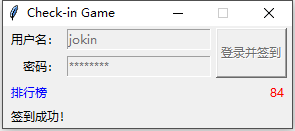

# 签到器 TCApps系列

**此工具不再提供可执行文件(EXE)的发布**



此工具仅用于进行TCApps签到游戏的签到。

官网网站：[https://checkin.tcapps.twocola.com](https://checkin.tcapps.twocola.com)

## 使用方法

- 登录官网注册账户
- 到[发布页](https://github.com/jokin1999/tcapps-checkin/releases)下载签到工具
- 在`checkin.py`文件的所属目录下使用命令行（如下）或双击`run.bat`
```python
python checkin.py
```

## 依赖

- requests

## 依赖安装

```python
pip install [依赖包名]
```
